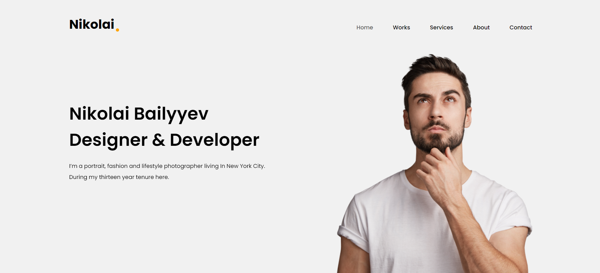

  
  

### 
Я Николай Байлыев и я Web Разработчик
  
  

- Владею адаптивной версткой  
  

- 🌱 Изучаю c#  
  

- ❓ есть опыт работы с Telegram api разработка ботов <a href="https://github.com/kola524/python_botergergert">python</a> aiogram  
  

- ⚡ Изучаю React js  
  

   

### Чем я владею 
<table><tr><td valign="top" width="33%">

### Навыки  

  
  
  
  
  
  
  
  
  
  
  
  

</td><td valign="top" width="33%">

</td><td valign="top" width="33%">

</td></tr></table>  

   

### Сайты Картинки кликабельны редирект на репозиторий с кодом сайта

   

